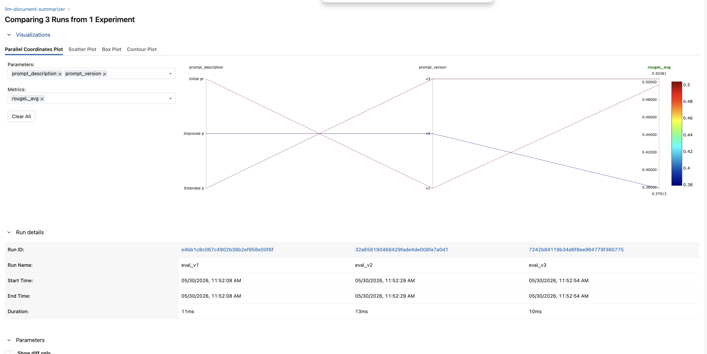
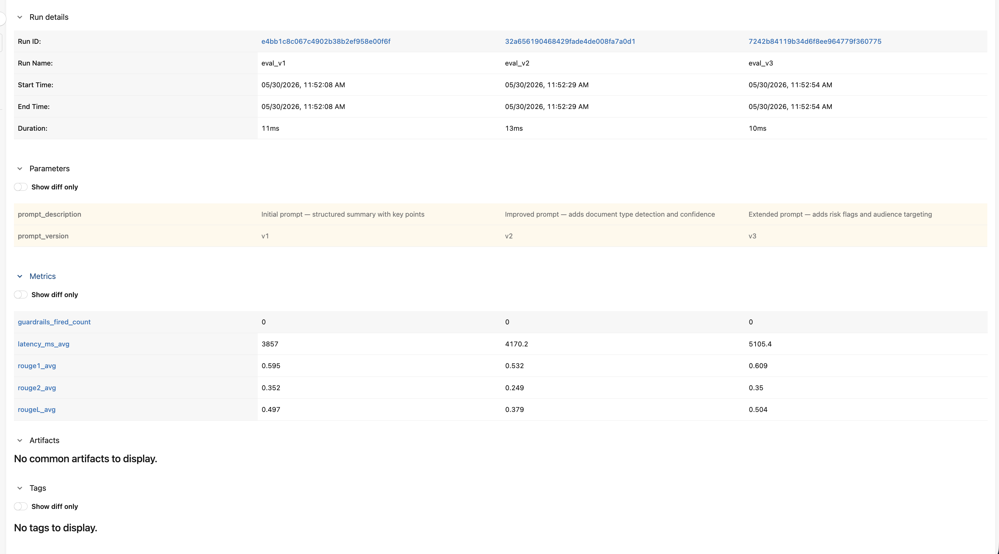

# llm-document-summarizer

PDF document summarization powered by Amazon Bedrock (Claude Haiku) with production LLMOps patterns: versioned prompt templates, automated ROUGE evaluation, Bedrock Guardrails for PII redaction and content filtering, and MLflow tracking of every inference call. Deployed on Azure App Service.

**Live demo → [llm-document-summarizer.azurewebsites.net/demo](https://llm-document-summarizer.azurewebsites.net/demo)**
&nbsp;&nbsp;·&nbsp;&nbsp;
**API docs → [/docs](https://llm-document-summarizer.azurewebsites.net/docs)**
&nbsp;&nbsp;·&nbsp;&nbsp;
**Notebook → notebook.ipynb**


---

## Table of Contents

- [0. Prerequisites](#0-prerequisites)
- [1. Quick Start](#1-quick-start)
- [2. Project Structure](#2-project-structure)
- [3. LLMOps Patterns](#3-llmops-patterns)
- [4. Prompt Versioning](#4-prompt-versioning)
- [5. Evaluation Pipeline](#5-evaluation-pipeline)
- [6. Bedrock Guardrails](#6-bedrock-guardrails)
- [7. API Reference](#7-api-reference)
- [8. MLflow Experiment Tracking](#8-mlflow-experiment-tracking)
- [9. Docker Compose Architecture](#9-docker-compose-architecture)
- [10. Deployment — Azure App Service](#10-deployment--azure-app-service)
- [11. CI/CD](#11-cicd)
- [12. Design Decisions](#12-design-decisions)
- [13. Dependencies](#13-dependencies)

---

## 0. Prerequisites

- **AWS account** with Amazon Bedrock enabled in `us-east-1`
- **Bedrock model access** granted for `us.anthropic.claude-haiku-4-5-20251001-v1:0`
- **Bedrock Guardrail** created in the AWS console (see [Bedrock Guardrails](#6-bedrock-guardrails))
- **Azure account** for deployment (optional for local use)
- AWS credentials configured via environment variables or `~/.aws/credentials`

---

## 1. Quick Start

### Path A: Docker Compose (recommended)

```bash
git clone https://github.com/xavier-oc-programming/llm-document-summarizer
cd llm-document-summarizer

# Set AWS credentials
export AWS_ACCESS_KEY_ID=your-key
export AWS_SECRET_ACCESS_KEY=your-secret

# Set your Bedrock Guardrail ID in config.py
# BEDROCK_GUARDRAIL_ID = 'your-guardrail-id'

docker-compose up
```

- API: http://localhost:8000
- API docs: http://localhost:8000/docs
- MLflow UI: http://localhost:5000

### Path B: Local without Docker

```bash
pip install -r requirements.txt

# Terminal 1 — MLflow server
mlflow server --host 0.0.0.0 --port 5000

# Terminal 2 — API
uvicorn main:app --reload
```

### Path C: API only (no MLflow)

```bash
pip install -r requirements.txt
uvicorn main:app --reload
```

MLflow logging fails silently — all other functionality works.

---

## 2. Project Structure

```
llm-document-summarizer/
├── config.py               # Single source of truth — constants and paths
├── prompt_manager.py       # Loads and formats versioned prompt templates
├── bedrock_client.py       # Bedrock API calls, guardrails, MLflow logging
├── pdf_extractor.py        # PDF text extraction via PyMuPDF
├── evaluate.py             # ROUGE evaluation pipeline — run before promoting prompts
├── main.py                 # FastAPI application
├── Dockerfile
├── docker-compose.yml      # API + MLflow tracking server
├── startup.txt             # Azure App Service startup command
├── notebook.ipynb          # LLMOps walkthrough
├── requirements.txt
├── portfolio.yaml
├── .gitignore
├── .github/
│   └── workflows/
│       └── ci.yml          # GitHub Actions CI
├── prompts/                # Versioned prompt templates (committed to Git)
│   ├── v1_summarize.yaml
│   ├── v2_summarize.yaml
│   └── v3_summarize.yaml
├── eval/                   # Held-out evaluation dataset (committed to Git)
│   ├── README.md
│   ├── documents/          # 5 input documents (business, research, news, legal, README)
│   └── references/         # 5 human-written reference summaries for ROUGE scoring
├── templates/
│   └── index.html          # Single-page demo frontend
├── tests/
│   └── test_api.py
├── assets/                 # Screenshots and images for README and notebook
│   ├── mlflow_parallel_coordinates.png
│   └── mlflow_metrics_comparison.png
├── conftest.py             # pytest path configuration
├── uploads/                # gitignored — PDF uploads at runtime
└── eval_results/           # gitignored — generated by evaluate.py
```

---

## 3. LLMOps Patterns

This project implements four LLMOps patterns that distinguish it from a basic LLM wrapper.

**Prompt versioning** — Prompts are stored as YAML files in `prompts/` with version numbers. Switching the active version is a one-line config change in `config.py`. The full history of every prompt version is in Git. This is the prompt equivalent of semantic versioning for software.

**Automated evaluation** — `evaluate.py` runs every prompt version against a held-out set of documents with human-written reference summaries and computes ROUGE scores. Before deploying a new prompt version, run `evaluate.py`. If the new version scores below `ROUGE_THRESHOLD` on the eval set, it does not go to production.

**Bedrock Guardrails** — Every Bedrock response passes through a guardrail before reaching the user. The guardrail anonymises PII (names, email addresses, phone numbers) and blocks harmful content. For enterprise document processing, this is a compliance requirement, not a nice-to-have.

**MLflow experiment tracking** — Every Bedrock call logs prompt version, latency, input/output length, and guardrails activity to MLflow. The eval pipeline logs ROUGE scores per prompt version. The MLflow UI shows the full history of prompt performance over time.

---

## 4. Prompt Versioning

Prompt templates live in `prompts/` as YAML files:

| Version | Description | New fields |
|---------|-------------|------------|
| v1 | Base structured summary | summary, key_points, main_argument, sentiment, recommended_action |
| v2 | Document type + confidence | + document_type, confidence |
| v3 | Risk flags + audience targeting | + target_audience, risk_flags (5 key points) |

**Switching versions** — change one line in `config.py`:

```python
ACTIVE_PROMPT_VERSION = 'v3'  # Change to 'v1', 'v2', or 'v3'
```

No redeployment needed for local use. On Azure, update the app setting and restart.

**Adding a new version** — create `prompts/v4_summarize.yaml` with `version: v4`, `created`, `description`, and `template` fields. Run `python evaluate.py` to measure performance before promoting to `ACTIVE_PROMPT_VERSION`.

---

## 5. Evaluation Pipeline

```bash
# Requires AWS credentials — MLflow logs to local mlruns/ by default
python evaluate.py
```

`evaluate.py` runs every prompt version (`v1`, `v2`, `v3`) against all five documents in `eval/documents/`, compares the generated `summary` field against the reference in `eval/references/` using ROUGE metrics, and logs results to MLflow.

**ROUGE metrics** measure lexical overlap between generated and reference text:
- **ROUGE-1** — unigram overlap
- **ROUGE-2** — bigram overlap
- **ROUGE-L** — longest common subsequence (primary metric)

Results are saved to `eval_results/eval_{timestamp}.json` and printed as a comparison table. The script recommends which prompt version to set as `ACTIVE_PROMPT_VERSION`.

**Minimum threshold** — `ROUGE_THRESHOLD = 0.3` in `config.py`. A prompt version scoring below this should not be promoted to production.

To extend the eval set, see [eval/README.md](eval/README.md).

---

## 6. Bedrock Guardrails

### Setup

1. Open the AWS console → **Amazon Bedrock → Guardrails → Create guardrail**
2. Configure:
   - **PII detection**: ANONYMIZE for Name, Email, Phone, Address
   - **Content filters**: input strength NONE, output strength HIGH for hate speech, violence, sexual content. Input filtering is intentionally disabled — a document summarizer must accept any document, including CVs with personal data. Only the generated summary is filtered.
   - **Grounding**: OFF
3. Copy the Guardrail ID and set it in `config.py`:
   ```python
   BEDROCK_GUARDRAIL_ID = 'your-guardrail-id'
   ```

### Behaviour

| Guardrail action | What happens |
|-----------------|--------------|
| ANONYMIZED | PII replaced with `[REDACTED]` in the summary. Response returned with a notice. |
| BLOCKED | Harmful content detected. Safe error response returned instead of model output. |

### Monitoring

Every call logs `guardrails_fired` (0 or 1) to MLflow. Run `evaluate.py` to see `guardrails_fired_count` per prompt version — a high count on the eval set indicates the documents themselves may contain sensitive content.

---

## 7. API Reference

### `POST /summarize`

Upload a PDF and receive a structured summary.

```bash
curl -X POST http://localhost:8000/summarize \
  -F "file=@document.pdf"
```

Returns `SummarizeResponse` with summary fields + metadata (prompt_version, latency_ms, guardrails_fired, page_count, word_count, truncated, model_id).

### `POST /summarize/text`

Summarize raw text directly — useful for testing without a PDF.

```bash
curl -X POST http://localhost:8000/summarize/text \
  -H "Content-Type: application/json" \
  -d '{"text": "Your document text here", "prompt_version": "v3"}'
```

### `GET /health`

Returns API status, active prompt version, and model ID.

### `GET /api/prompt-versions`

Returns all available prompt versions with metadata (version, created, description).

### `GET /api/active-prompt`

Returns the currently active prompt template (version, description, template string).

### `GET /api/eval-results`

Returns the most recent evaluation results from `eval_results/`. Returns a message if no results exist yet.

Full interactive docs at `/docs`.

---

## 8. MLflow Experiment Tracking

Every call to `bedrock_client.summarize_document()` logs to MLflow under the `llm-document-summarizer` experiment:

| Metric / param | Description |
|----------------|-------------|
| `prompt_version` | Which prompt template was used |
| `model_id` | Bedrock model ID |
| `latency_ms` | End-to-end Bedrock call duration |
| `input_length` | Characters sent to Bedrock |
| `output_length` | Characters returned |
| `guardrails_fired` | 1 if guardrail triggered, 0 otherwise |

`evaluate.py` additionally logs `rouge1_avg`, `rouge2_avg`, `rougeL_avg`, `latency_ms_avg`, and `guardrails_fired_count` per prompt version — enabling direct comparison in the MLflow experiment view.

**Parallel coordinates plot** (eval_v1 vs eval_v2 vs eval_v3, metric: ROUGE-L):



**Metrics comparison table**:



---

## 9. Docker Compose Architecture

```
┌─────────────────────┐     ┌──────────────────────┐
│   api (port 8000)   │────▶│  mlflow (port 5000)  │
│   FastAPI + Uvicorn │     │  Tracking server     │
│   AWS Bedrock calls │     │  /mlruns volume      │
└─────────────────────┘     └──────────────────────┘
```

AWS credentials are passed as environment variables — never hardcoded. Set them in your shell before running `docker-compose up`, or add them to a `.env` file (gitignored).

---

## 10. Deployment — Azure App Service

```bash
# Create resource group and app service plan
az group create --name llm-summarizer-rg --location westeurope
az appservice plan create --name llm-summarizer-plan \
  --resource-group llm-summarizer-rg --sku F1 --is-linux

# F1 is the free tier — no monthly charge. Cold starts take ~30s after inactivity.
# Scale to B1 for always-on: az appservice plan update --name llm-summarizer-plan --resource-group llm-summarizer-rg --sku B1

# Create web app
az webapp create --name llm-document-summarizer \
  --resource-group llm-summarizer-rg \
  --plan llm-summarizer-plan \
  --runtime "PYTHON:3.11"

# Set startup command
az webapp config set --name llm-document-summarizer \
  --resource-group llm-summarizer-rg \
  --startup-file "gunicorn main:app --workers 1 --worker-class uvicorn.workers.UvicornWorker --bind 0.0.0.0:8000 --timeout 600"

# Set app settings (AWS credentials as env vars — never in code)
az webapp config appsettings set --name llm-document-summarizer \
  --resource-group llm-summarizer-rg \
  --settings \
    SCM_DO_BUILD_DURING_DEPLOYMENT=true \
    AWS_ACCESS_KEY_ID=<your-key> \
    AWS_SECRET_ACCESS_KEY=<your-secret> \
    AWS_DEFAULT_REGION=us-east-1 \
    BEDROCK_GUARDRAIL_ID=<your-guardrail-id>

# Package and deploy
cd llm-document-summarizer
zip -r deploy.zip . -x "*.git*" -x "venv/*" -x "__pycache__/*" \
  -x "*.ipynb_checkpoints*" -x "mlruns/*" -x "uploads/*" -x "eval_results/*"
az webapp deployment source config-zip \
  --name llm-document-summarizer \
  --resource-group llm-summarizer-rg \
  --src deploy.zip
```

AWS credentials are set as Azure App Service Application Settings — they never appear in the codebase or Git history.

---

## 11. CI/CD

GitHub Actions runs on every push to `main` and every pull request:

- Installs dependencies
- Runs `pytest tests/ -v`
- Verifies all three prompt YAML files exist
- Verifies the eval set exists

Tests do not require AWS credentials — `/summarize/text` returns 503 gracefully when credentials are absent. `evaluate.py` is not run in CI as it requires live Bedrock access.

---

## 12. Design Decisions

**Why prompt versioning as YAML files rather than database entries** — YAML files are the simplest approach that gives you everything you need: Git history, human-readable diffs, no external dependency, and zero operational overhead. A database adds complexity without adding capability for a project at this scale. The prompt history is in Git where all version history belongs.

**Why ROUGE as the evaluation metric despite its limitations** — ROUGE measures lexical overlap, which is imperfect for abstractive summarization — a paraphrased but accurate summary can score low. I chose ROUGE because it is the standard benchmark for summarization tasks, it is automated (no LLM-as-judge API call required), and it produces consistent, reproducible scores across runs. The eval set and reference summaries are written to maximise ROUGE signal by using specific terms and numbers that should appear in good summaries.

**Why Bedrock Guardrails over manual output filtering** — Guardrails run server-side inside Bedrock before the response is returned, which means PII redaction cannot be bypassed by a prompt injection attack on the client side. Manual filtering in application code would operate on already-returned text and would require maintaining regex patterns for each PII type. Guardrails also provide a compliance-grade audit trail. Input content filtering is intentionally set to NONE — enabling it at any strength blocked legitimate documents (CVs containing disability certificates, phone numbers, or personal contact data). The right boundary for a document summarizer is the output: accept anything, return only safe summaries.

**Why MLflow for LLM tracking (same tool as classical ML — consistency)** — The credit-risk-scorer project already uses MLflow for classical ML experiment tracking. Using the same tool for LLM evaluation tracking means one UI, one mental model, and one operational system to maintain. The analogy is direct: a prompt version maps to a model version; ROUGE scores map to accuracy metrics; guardrails activity maps to data quality flags.

**Why FastAPI over Flask** — FastAPI provides automatic request validation via Pydantic, auto-generated OpenAPI docs at `/docs`, and native async support. It is consistent with the credit-risk-scorer project. For a project where the API contract (request/response schema) is a first-class concern, FastAPI's type-driven approach reduces bugs and improves documentation with no extra effort.

**Why the eval set is committed to the repo** — Reproducibility requires the data to be version-controlled alongside the code and prompts. A future developer running `evaluate.py` should get results comparable to the original run, which is only possible if the eval set is pinned in Git. This is the same principle as committing test fixtures.

---

## 13. Dependencies

| Package | Version | Purpose |
|---------|---------|---------|
| pymupdf | ≥1.23 | PDF text extraction |
| boto3 | ≥1.34 | Amazon Bedrock API and Guardrails |
| pyyaml | ≥6.0 | Prompt template YAML loading |
| rouge-score | ≥0.1.2 | ROUGE metric computation |
| mlflow | ≥2.10 | Experiment tracking |
| fastapi | ≥0.110 | REST API framework |
| uvicorn | ≥0.27 | ASGI server |
| gunicorn | ≥21.0 | Production WSGI/ASGI server |
| pydantic | ≥2.0 | Request/response validation |
| pandas | ≥2.0 | Data handling in evaluation |
| numpy | ≥1.24,<2.0 | Numerical operations |
| matplotlib | ≥3.7 | Notebook visualisations |
| jupyter | ≥1.0 | Notebook environment |
| pytest | ≥7.0 | Test framework |
| httpx | ≥0.27 | Async HTTP client (FastAPI test client) |
| python-multipart | ≥0.0.9 | Multipart file upload parsing |
